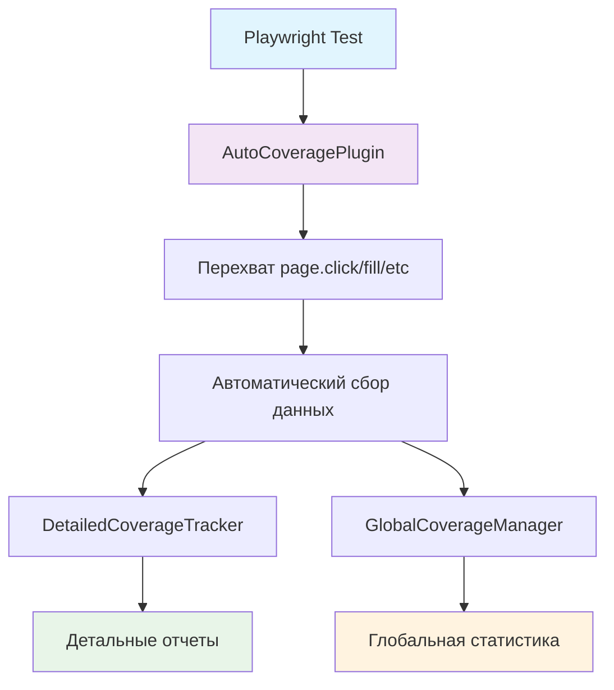

# Автоматическое покрытие UI - Минимальные изменения

## 🎯 Проблема

Существующие решения покрытия UI требуют множественных изменений в тестах:
- Импорт специальных модулей
- Вызовы методов трекинга в каждом тесте
- Ручная генерация отчетов
- Изменение структуры тестов

## ✨ Решение

**Автоматическое покрытие UI** - работает БЕЗ изменений в тестах!

### Что требуется:
1. **Только конфигурация** в `playwright.config.js`
2. **Один файл плагина** в проект
3. **Никаких изменений** в существующих тестах

## 🚀 Быстрый старт

### 1. Добавьте конфигурацию

```javascript
// playwright.config.js
export default defineConfig({
  // ... существующая конфигурация
  
  use: {
    // ... существующие настройки
    
    // ЕДИНСТВЕННОЕ изменение - добавить эту секцию:
    autoCoverage: {
      enabled: true,
      outputDir: './coverage-reports',
      generateReports: true,
      trackAllPages: true
    }
  }
});
```

### 2. Скопируйте плагин

```bash
# Скопируйте файл плагина в ваш проект
cp lib/autoCoveragePlugin.js your-project/lib/
```

### 3. Запускайте тесты как обычно

```bash
# Никаких изменений в команде запуска!
npx playwright test

# Отчеты автоматически создаются в ./coverage-reports/
```

## 📊 Что получаете автоматически

### Отслеживание действий
- ✅ `page.click()` - все клики
- ✅ `page.fill()` - заполнение полей  
- ✅ `page.selectOption()` - выбор в селектах
- ✅ `page.check()/uncheck()` - чекбоксы
- ✅ Навигация между страницами
- ✅ Информация об элементах (тип, роль, текст)

### Автоматические отчеты
- 📄 `auto-coverage-summary.md` - человекочитаемый отчет
- 📊 `auto-coverage-summary.json` - данные для интеграции
- 🔍 `auto-coverage-detailed.json` - детальная информация
- 🌐 `auto-coverage-global.json` - глобальная статистика

## 🧪 Демонстрация

```bash
# Запуск демо
npm run demo:auto

# Или напрямую
node demo-auto-coverage.js
```

### Пример вывода:
```
🚀 Демонстрация автоматического покрытия UI
==================================================

📋 Что демонстрирует этот пример:
• Автоматическое отслеживание всех действий в тестах
• Минимальные изменения в коде (только конфигурация)
• Автоматическая генерация отчетов покрытия

📈 Статистика:
• Всего тестов: 5
• Всего взаимодействий: 12
• Уникальных элементов: 8
• Типы действий:
  - click: 7
  - fill: 3
  - check: 1
  - select: 1
```

## 🔧 Архитектура



## 📁 Структура файлов

```
your-project/
├── lib/
│   └── autoCoveragePlugin.js     # Основной плагин (копируйте этот файл)
├── playwright.config.js          # Добавить autoCoverage секцию
├── tests/
│   └── *.spec.js                # БЕЗ изменений!
└── coverage-reports/            # Автоматически создается
    ├── auto-coverage-summary.md
    ├── auto-coverage-summary.json
    ├── auto-coverage-detailed.json
    └── auto-coverage-global.json
```

## 🎯 Сравнение подходов

| Функция | Ручное покрытие | Автоматическое |
|---------|----------------|----------------|
| Изменения в тестах | ❌ Много | ✅ Ноль |
| Настройка | ❌ Сложная | ✅ Одна строка |
| Отслеживание | ❌ Ручное | ✅ Автоматическое |
| Отчеты | ❌ Ручная генерация | ✅ Автоматические |
| Интеграция | ❌ Сложная | ✅ Простая |
| Поддержка | ❌ Требует обновления тестов | ✅ Работает с любыми тестами |

## 🔄 Интеграция в существующий проект

### Шаг 1: Добавьте файлы
```bash
# Скопируйте плагин
cp DemoProject/lib/autoCoveragePlugin.js your-project/lib/

# Опционально: скопируйте зависимости если нужны детальные отчеты
cp DemoProject/lib/detailedCoverageTracker.js your-project/lib/
cp DemoProject/lib/uiCoverageAnalyzer.js your-project/lib/
cp DemoProject/lib/globalCoverageManager.js your-project/lib/
```

### Шаг 2: Обновите конфигурацию
```javascript
// playwright.config.js - добавьте в use секцию
autoCoverage: {
  enabled: true,                    // включить/выключить
  outputDir: './coverage-reports',  // папка для отчетов
  generateReports: true,            // генерировать отчеты
  trackAllPages: true              // отслеживать все страницы
}
```

### Шаг 3: Запустите тесты
```bash
# Никаких изменений в командах!
npx playwright test

# Проверьте отчеты
ls coverage-reports/
```

## 🛠️ Настройки

```javascript
autoCoverage: {
  enabled: true,                    // Включить/выключить покрытие
  outputDir: './coverage-reports',  // Папка для отчетов
  generateReports: true,            // Генерировать отчеты автоматически
  trackAllPages: true,             // Отслеживать все посещенные страницы
  
  // Дополнительные настройки (опционально):
  includeSnapshots: false,         // Включать снимки страниц
  trackPerformance: false,         // Отслеживать производительность
  customActions: ['hover', 'dblclick'] // Дополнительные действия
}
```

## 🚀 Преимущества

### Для разработчиков:
- ✅ **Ноль изменений** в существующих тестах
- ✅ **Мгновенная интеграция** - добавил конфиг и работает
- ✅ **Автоматические отчеты** - не нужно помнить генерировать
- ✅ **Совместимость** - работает с любыми Playwright тестами

### Для команды:
- ✅ **Быстрое внедрение** - не нужно переписывать тесты
- ✅ **Консистентность** - все тесты автоматически отслеживаются
- ✅ **Масштабируемость** - работает с любым количеством тестов
- ✅ **Поддержка** - не требует обучения команды

### Для CI/CD:
- ✅ **Простая интеграция** - никаких изменений в пайплайнах
- ✅ **Автоматические артефакты** - отчеты создаются сами
- ✅ **Стабильность** - не влияет на выполнение тестов
- ✅ **Мониторинг** - автоматическое отслеживание покрытия

## 📈 Примеры отчетов

### Сводный отчет (auto-coverage-summary.md):
```markdown
# Автоматический отчет покрытия UI

## Сводка
- **Всего тестов**: 5
- **Прошедших**: 4
- **Упавших**: 1
- **Всего взаимодействий**: 12
- **Уникальных элементов**: 8

## Типы действий
- **click**: 7
- **fill**: 3
- **check**: 1
- **select**: 1

## Покрытие элементов
### `text=Get started`
- **Взаимодействий**: 3
- **Действия**: click
- **Тесты**: Обычный тест - покрытие отслеживается автоматически
```

### JSON данные (auto-coverage-summary.json):
```json
{
  "summary": {
    "totalTests": 5,
    "passedTests": 4,
    "failedTests": 1,
    "totalInteractions": 12,
    "uniqueElements": 8,
    "actionTypes": {
      "click": 7,
      "fill": 3,
      "check": 1,
      "select": 1
    }
  },
  "elements": [
    {
      "selector": "text=Get started",
      "interactionCount": 3,
      "actions": ["click"],
      "tests": ["Обычный тест - покрытие отслеживается автоматически"]
    }
  ]
}
```

## ❓ FAQ

**Q: Нужно ли изменять существующие тесты?**
A: НЕТ! Это главное преимущество - ноль изменений в тестах.

**Q: Влияет ли на производительность тестов?**
A: Минимально - только перехват методов и сбор метаданных.

**Q: Работает ли с Page Object Model?**
A: ДА! Работает с любой архитектурой тестов.

**Q: Можно ли отключить для конкретных тестов?**
A: ДА! Установите `enabled: false` в конфигурации.

**Q: Совместимо ли с другими репортерами?**
A: ДА! Работает параллельно с Allure, HTML и другими.

## 🔗 Ссылки

- [Исходный код AutoCoveragePlugin](lib/autoCoveragePlugin.js)
- [Демонстрационные тесты](tests/auto-coverage.spec.js)
- [Пример конфигурации](playwright.config.js)
- [Демо скрипт](demo-auto-coverage.js)

---

**🎯 Главное преимущество: Максимальная функциональность при минимальных изменениях!** 