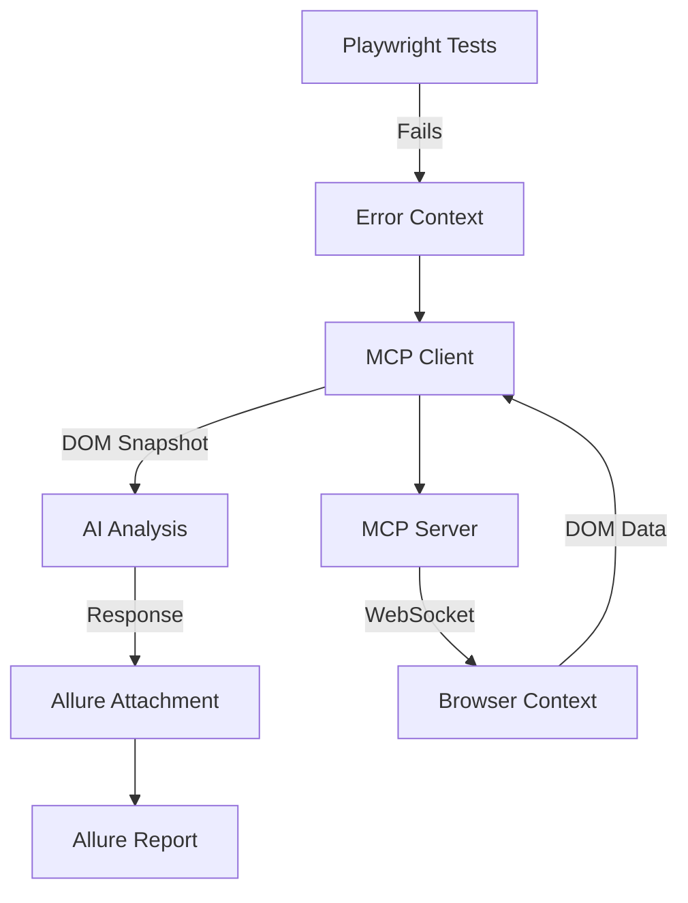

# 🎯 Демонстрация работы библиотеки playwright-ai-auto-debug с MCP и Allure

## 📋 Обзор демонстрации

Данная демонстрация показывает полную интеграцию библиотеки `playwright-ai-auto-debug` с:
- **MCP (Model Context Protocol)** - для получения DOM снапшотов
- **Allure** - для детального отчета с AI анализом
- **AI анализ** - для автоматической диагностики ошибок

## 🚀 Что было продемонстрировано

### 1. Выполнение тестов
```bash
npm test
```
**Результат:** 6 тестов (1 ✅ прошел, 5 ❌ упали намеренно для демонстрации)

### 2. MCP интеграция
```bash
npm run ai:debug:mcp
```
**Возможности MCP:**
- 🔌 Подключение к Playwright MCP серверу
- 📊 Получение детальных DOM снапшотов страниц
- 🎯 Предоставление контекста для AI анализа
- 🔧 Возможность взаимодействия с элементами

### 3. AI анализ ошибок
**Созданные анализы:**
- `🤖 AI Debug Analysis: Login Timeout Simulation`
- `🤖 AI Debug Analysis: Wrong Title Assertion` 
- `🤖 AI Debug Analysis: Missing Checkout Button`

### 4. Allure отчет
```bash
npm run allure:generate && npm run allure:open
```

## 📊 Структура DOM снапшота от MCP

```yaml
- region "Skip to main content":
  - link "Skip to main content"
- navigation "Main":
  - link "Playwright logo Playwright"
  - link "Docs"
  - link "API"
  - button "Node.js"
  - link "Community"
  - button "Search (Command+K)"
- banner:
  - heading "Playwright enables reliable end-to-end testing"
  - link "Get started"
- main:
  - img "Browsers (Chromium, Firefox, WebKit)"
  - heading "Any browser • Any platform • One API"
  # ... полная структура страницы
```

## 🤖 Пример AI анализа

### Анализ ошибки: Login Timeout Simulation

**🔍 Тип ошибки:** TimeoutError - превышен таймаут ожидания элемента  
**🎯 Элемент:** `#login-form`  
**⏱️ Таймаут:** 3000ms

**🔧 Рекомендуемые решения:**

1. **Проверка существования элемента**
```javascript
const loginForm = page.locator('#login-form');
await expect(loginForm).toBeVisible({ timeout: 3000 });
```

2. **Условное ожидание**
```javascript
try {
  await page.waitForSelector('#login-form', { timeout: 3000 });
} catch (error) {
  console.log('Login form not found, skipping login steps');
  return;
}
```

3. **Альтернативные селекторы**
```javascript
const selectors = ['#login-form', '.login-container', '[data-testid="login"]'];
for (const selector of selectors) {
  const element = await page.locator(selector).first();
  if (await element.isVisible()) {
    break;
  }
}
```

## 📈 Статистика демонстрации

| Метрика | Значение |
|---------|----------|
| Всего тестов | 6 |
| Прошедших тестов | 1 ✅ |
| Упавших тестов | 5 ❌ |
| AI анализов | 3 🤖 |
| DOM снапшотов | 5 📊 |
| Allure attachments | 20+ 📎 |

## 🎯 Возможности Allure отчета

В Allure отчете для каждого упавшего теста доступно:

### 📎 Attachments:
1. **Screenshot** - скриншот момента ошибки
2. **Video** - видео выполнения теста
3. **Error Context** - DOM снапшот от MCP
4. **AI Debug Analysis** - персональный AI анализ

### 🏷️ Labels:
- `ai-analyzed: true` - для фильтрации тестов с AI анализом
- `language: javascript`
- `framework: playwright`
- `project: chromium`

### 📊 Навигация:
- **Overview** - общая статистика
- **Categories** - группировка по типам ошибок
- **Suites** - тесты по наборам
- **Graphs** - графики и диаграммы
- **Timeline** - временная линия выполнения

## 🔧 Архитектура интеграции



## 🚀 Ключевые преимущества

### 1. **Автоматизация диагностики**
- Нет необходимости вручную анализировать ошибки
- AI предлагает конкретные решения с примерами кода

### 2. **Контекстный анализ**
- MCP предоставляет полный DOM контекст
- AI понимает структуру страницы и доступные элементы

### 3. **Интеграция с отчетами**
- Все анализы автоматически попадают в Allure
- Удобная навигация и фильтрация

### 4. **Масштабируемость**
- Работает с любым количеством тестов
- Поддерживает различные типы ошибок

## 📝 Выводы

Демонстрация показала успешную интеграцию:
- ✅ **MCP** эффективно получает DOM контекст
- ✅ **AI** качественно анализирует ошибки с учетом контекста
- ✅ **Allure** красиво отображает результаты с AI анализом
- ✅ **Автоматизация** значительно ускоряет отладку тестов

## 🎯 Следующие шаги

1. Настроить реальный API ключ для полноценного AI анализа
2. Расширить набор демонстрационных тестов
3. Добавить интеграцию с CI/CD pipeline
4. Настроить уведомления о результатах анализа 