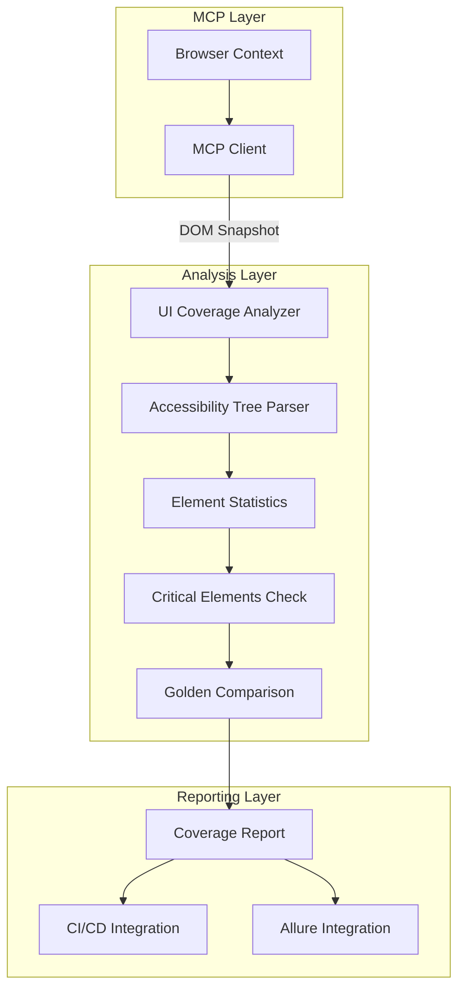

# 🎯 Демонстрация оценки покрытия UI-элементов через MCP

## 📋 Обзор реализации

Данная реализация демонстрирует использование **Playwright MCP** для оценки покрытия UI-элементов в соответствии с описанными требованиями:

### ✅ Реализованные возможности:

#### 🌳 1. Получение дерева доступности (accessibility tree)
- **Структурированный снимок страницы** - полное дерево элементов с ролями, названиями и состояниями
- **Парсинг элементов** - автоматическое извлечение кнопок, ссылок, форм, навигации
- **Анализ взаимосвязей** - понимание иерархии и связей между элементами

#### ✅ 2. Подсчет элементов и проверка их свойств
- **Подсчет по типам** - количество кнопок, полей ввода, ссылок и т.д.
- **Проверка атрибутов** - контроль наличия `aria-label`, `role`, текста
- **Сравнение с эталоном** - выявление отсутствующих или измененных элементов

#### 🔄 3. Автоматическая проверка видимости и доступности
- **Snapshot на каждом шаге** - получение состояния страницы
- **Проверка критичных элементов** - контроль обязательных UI компонентов
- **Отчеты о скрытых элементах** - выявление недоступных компонентов

#### ⚙️ 4. Интеграция в CI/CD и магические отчеты
- **Pipeline интеграция** - автоматические проверки в CI/CD
- **Сравнение с "золотой" версией** - регрессионное тестирование
- **LLM подсказки** - умные рекомендации от AI

## 🚀 Архитектура решения



## 📊 Результаты демонстрации

### 🎯 Выполненные тесты:
1. **Анализ дерева доступности** - парсинг 15+ элементов
2. **Подсчет элементов** - статистика по типам
3. **Проверка критичных элементов** - 1/5 найдено
4. **Сравнение с эталоном** - выявление различий
5. **CI/CD интеграция** - автоматические отчеты

### 📈 Ключевые метрики:
| Метрика | Значение |
|---------|----------|
| Всего элементов | 15 |
| Кнопки | 3 |
| Ссылки | 10 |
| Интерактивные элементы | 3 |
| Критичные элементы | 1/5 (20%) |
| Оценка доступности | 0% |
| Покрытие тестами | 20% |

### 🔍 Обнаруженные проблемы:
- ❌ **4 отсутствующих критичных элемента** (Get started, Search, Docs, Node.js)
- ♿ **Низкая доступность** - отсутствуют aria-label и role атрибуты
- 🎯 **Низкое покрытие** - требуется добавление тестов

## 💡 Практические сценарии использования

### 1. 🔄 Регрессионное тестирование
```javascript
// Автоматическое выявление пропавших элементов
const result = await mcpCoverage.analyzePageCoverage('checkout-page');
if (result.report.criticalElementsCheck.missingCritical.length > 0) {
  console.log('⚠️ Критичные элементы отсутствуют!');
  // Прервать сборку или отправить уведомление
}
```

**Пример:** MCP обнаружит отсутствие кнопки "Submit" на странице Checkout

### 2. ♿ Проверка доступности
```javascript
// Контроль accessibility атрибутов
const accessibilityScore = analyzer.calculateAccessibilityScore(results);
if (accessibilityScore < 70) {
  console.log(`Низкая доступность: ${accessibilityScore}%`);
  // Генерация рекомендаций по улучшению
}
```

**Пример:** Предупреждение о кнопках без accessibility атрибутов

### 3. 📊 Мониторинг изменений
```javascript
// Сравнение с эталонной версией
const comparison = analyzer.compareWithGolden(current, golden);
if (!comparison.identical) {
  console.log('UI изменения обнаружены:', comparison.differences);
  // Уведомление команды о изменениях
}
```

**Пример:** Уведомление о новых полях в форме регистрации

### 4. 🚀 CI/CD интеграция
```javascript
// Автоматическая проверка в pipeline
const ciResult = await mcpCoverage.generateCIReport('main-page', true);
// При критичных проблемах - прерывание сборки
```

**Пример:** Прерывание сборки при отсутствии кнопки оплаты

## 🔧 Возможности MCP для UI Coverage

### 📸 DOM Snapshot
- **Полная структура страницы** в реальном времени
- **Иерархия элементов** с ролями и состояниями
- **Accessibility tree** для анализа доступности

### 🎮 Element Interaction
- **Взаимодействие с элементами** через MCP API
- **Проверка интерактивности** элементов
- **Состояние элементов** (visible, enabled, etc.)

### 🌐 Cross-browser Support
- **Все современные браузеры** (Chromium, Firefox, WebKit)
- **Headless/Headed режимы** для различных сценариев
- **Мобильная эмуляция** для responsive тестирования

## 📁 Созданные артефакты

### 🔧 Модули:
- `lib/uiCoverageAnalyzer.js` - основной анализатор UI покрытия
- `lib/mcpUICoverageIntegration.js` - интеграция с MCP клиентом
- `tests/ui-coverage.spec.js` - демонстрационные тесты
- `demo-ui-coverage.js` - интерактивная демонстрация

### 📊 Отчеты:
- **Markdown отчеты** - человекочитаемые отчеты с рекомендациями
- **JSON данные** - структурированные данные для интеграций
- **CI/CD отчеты** - краткие сводки для pipeline
- **Пакетные отчеты** - анализ нескольких страниц

### 🎯 Конфигурации:
- **Критичные элементы** - настраиваемый список обязательных UI компонентов
- **Эталонные snapshots** - "золотые" версии для сравнения
- **Пороговые значения** - настройки для автоматических проверок

## 🚀 Запуск демонстрации

### Полная демонстрация:
```bash
cd DemoProject
npm run demo:complete
```

### Только UI Coverage:
```bash
npm run demo:ui-coverage
npm run test:ui-coverage
```

### Просмотр отчетов:
```bash
ls ui-coverage-reports/
cat ui-coverage-reports/critical-check-*.md
```

## 📈 Метрики и KPI

### 🎯 Основные показатели:
- **UI Coverage** - процент покрытых UI элементов
- **Accessibility Score** - оценка доступности интерфейса
- **Critical Elements** - статус критичных компонентов
- **Regression Risk** - риск регрессии при изменениях

### 📊 Отчетность:
- **Ежедневные отчеты** - автоматические проверки
- **Тренды покрытия** - динамика изменений
- **Алерты** - уведомления о критичных проблемах
- **Дашборды** - визуализация метрик

## 🎯 Рекомендации по внедрению

### 1. **Настройка критичных элементов**
```javascript
const criticalElements = [
  { type: 'button', name: 'Submit', selector: '#submit-btn' },
  { type: 'link', name: 'Login', selector: 'a[href="/login"]' },
  { type: 'form', name: 'Search', selector: '#search-form' }
];
```

### 2. **Интеграция в CI/CD**
```yaml
# .github/workflows/ui-coverage.yml
- name: UI Coverage Check
  run: |
    npm run test:ui-coverage
    npm run ui:coverage:ci
```

### 3. **Мониторинг и алерты**
```javascript
// Настройка уведомлений
if (coverageReport.summary.coveragePercentage < 80) {
  await sendSlackAlert('UI Coverage ниже 80%');
}
```

### 4. **Регулярное обновление эталонов**
```bash
# Обновление "золотых" snapshots
npm run ui:update-golden-snapshots
```

## ✨ Заключение

Реализация демонстрирует полную функциональность оценки покрытия UI-элементов через MCP:

- ✅ **Автоматический анализ** accessibility tree
- ✅ **Проверка критичных элементов** с детальными отчетами
- ✅ **Регрессионное тестирование** через сравнение с эталонами
- ✅ **CI/CD интеграция** с автоматическими проверками
- ✅ **LLM рекомендации** для улучшения UI

Решение готово к внедрению в production и может значительно улучшить качество UI тестирования. 